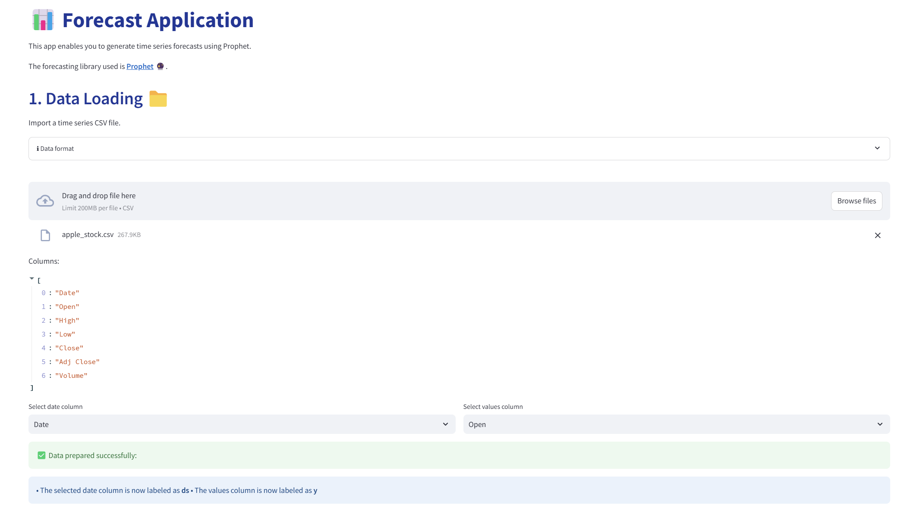
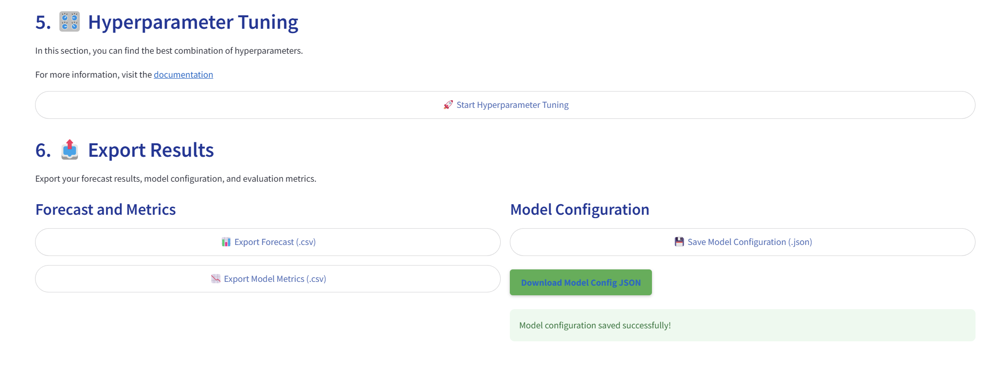

# Forecast Application

A powerful tool designed to help you predict future values based on historical time series data. This app makes time series forecasting accessible and user-friendly.

This repository contains a **Forecast Application** built using **Streamlit**, **Prophet**, and **Plotly**. The app allows users to generate future forecasts based on historical time series data.

## Features

- **CSV Upload**: Import your time series data in CSV format.
- **Customizable Forecasting**: Configure forecast horizon, growth model, and seasonality options.
- **Interactive Visualizations**: View the forecast results with interactive charts built using Plotly and Altair.
- **Model Evaluation**: Perform cross-validation and view important performance metrics.
- **Hyperparameter Tuning**: Automatically optimize model parameters for better accuracy.
- **Export Capabilities**: Export the forecast data and model configuration for further analysis.

### What This App Does

The Forecast App utilizes the **Prophet** forecasting system, developed by Facebook's Core Data Science team. Here's what you can do:

1. Upload your time series data.
2. Configure various forecasting parameters.
3. Generate predictions for future time periods.
4. Visualize the results.
5. Evaluate the model's performance.
6. Export the results for further analysis.

## Installation

You can view a live demo of this application on **Hugging Face Spaces** without setting it up locally:

[Forecast Application on Hugging Face](https://huggingface.co/spaces/Mohit-1963/Forecast_application)

If you'd like to run this application locally, follow the instructions below.


### Issue in the above demo 


#### AxiosError: Request failed with status code 403

If you encounter a **403 AxiosError** during CSV upload, this is a known issue related to **Cross-Origin Resource Sharing (CORS)** policies. This issue often occurs when deploying the app on certain platforms, such as **Hugging Face Spaces**.

The app runs without issues in local environments, but CORS policies on remote servers can block certain actions, like file uploads. 

**What does this mean?**
- **CORS** is a security feature in web browsers that restricts web applications from making requests to a domain different from the one that served the web page. In this case, it can prevent the app from accepting uploads from certain sources.

**What have I done to address this?**
- Locally, this issue doesn't arise, but for deployment, I disabled CORS within the application. Unfortunately, some hosting platforms like Hugging Face may still enforce stricter policies.

The app will demonstrate its full capabilities without any issues when running locally.


### Run Locally

#### Prerequisites

Ensure you have **Docker** installed on your machine. If not, you can download and install it from [here](https://www.docker.com/get-started).

### Clone the Repository

```bash
git clone https://github.com/MohitKapoor19/forecast_test.git
cd forecast-app
docker build -t forecast-app
docker run -p 7860:7860 forecast-app
```
**Check app the running at this url** http://localhost:7860/

## Usage

### Step 1: Data Loading

Start by uploading your time series CSV file. You will select the date column and the value column (for the metric you're forecasting). 



- The app will display a preview of the available columns for easy selection.


### Step 2: Data Visualization

Once the data is uploaded and the columns are selected, you can view the data through an interactive chart and a statistical description of the dataset.


- The chart allows you to visually confirm the trend of the data before moving to the next steps.


### Step 3: Parameter Configuration

Configure the parameters to control the forecast:
- Select the forecast horizon (how far into the future you want to predict).
- Set the seasonality mode (additive or multiplicative).
- Choose a linear or logistic growth model.
- Toggle options for daily, weekly, monthly, and yearly seasonalities.
- Add holiday effects based on your country.


### Step 4: Model Fitting and Forecasting

Click **"Initialize and Fit Model"** to train the Prophet model on your data. Once trained, click **"Generate Forecast"** to predict future values.

- After the forecast is generated, you can view a plot of the forecast along with confidence intervals.


- The forecast components, including overall trend, seasonal patterns, and holidays, will be displayed.


### Step 5: Change Points in Trend

The app highlights important change points in the trend. These change points mark significant shifts in the data's trajectory, helping to fine-tune the model.


### Step 6: Model Validation

You can validate the model by performing cross-validation. This process compares the predicted values against actual values in unseen data and computes various error metrics (e.g., RMSE, MAE, MAPE).


### Step 7: Performance Metrics

Once cross-validation is complete, the performance metrics are shown in a table. These metrics help to assess how well the model is performing.


### Step 8: Hyperparameter Tuning

To further improve the forecast, the app includes an option for hyperparameter tuning. It evaluates different combinations of key parameters (e.g., changepoint prior scale and seasonality prior scale) to minimize the error metrics.


### Step 9: Export Results

After completing your analysis, you can export both the forecast data and the model configuration. The results are available for download as CSV files, allowing for further exploration or sharing.



## Conclusion

This step-by-step guide provides an overview of how to use the Forecast Application. With interactive visualizations, configurable forecasting options, model evaluation, and export capabilities, this tool makes forecasting accessible and user-friendly for a wide range of time series applications.
